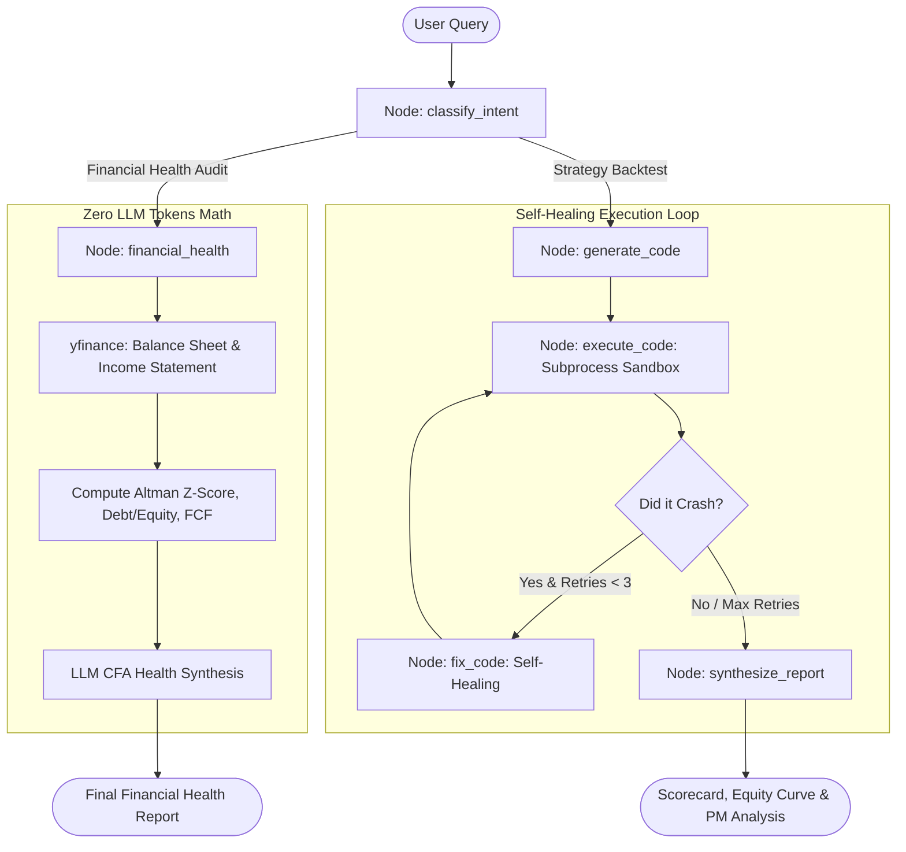

# AlphaAgent 📈🤖

An autonomous, token-efficient quantitative financial intelligence agent built on **LangChain** and **LangGraph**.

AlphaAgent solves two real-world capital market problems:
1. **Quantitative Strategy Backtesting with Autonomous Self-Healing**: Translates natural language trading hypotheses into executable Python code, runs backtests against historical market data, and iteratively fixes runtime errors using an automated self-healing feedback loop.
2. **Deterministic Corporate Financial Health & Solvency Audits**: Ingests real-world balance sheets and income statements via `yfinance` to compute critical financial health indicators (including the **Altman Z-Score** for bankruptcy prediction, Piotroski scores, and liquidity ratios) with **zero LLM token consumption**.

---

## 🏛️ Architecture & Workflow

AlphaAgent utilizes a hybrid **"Brain vs. Hands"** architecture: heavy math, live market data downloads, and backtesting formulas are offloaded to local deterministic Python code, while the LLM is reserved for intent parsing, code generation, and qualitative executive synthesis.



---

## ✨ Key Features

- **Stateful Graph Machine (`LangGraph`)**: Explicit `TypedDict` state schema managing transitions, error logs, and metrics.
- **Autonomous Self-Healing Loop**: If a generated backtest throws a `KeyError`, `IndexError`, or syntax issue, LangGraph catches the traceback and routes it back to the agent to rewrite the code (up to 3 retries).
- **Subprocess Execution Sandbox**: Isolated local execution environment with timeout safeguards, stdout/stderr capture, and equity curve chart plotting.
- **Ultra-Low Token Architecture**: Total query cost is ~1,000–2,000 tokens (< $0.002 per run).
- **Dual LLM Support**: Works seamlessly with Google Gemini (free tier) and OpenAI.

---

## 🚀 Quickstart

### 1. Clone & Setup Virtual Environment

```bash
git clone https://github.com/<your-username>/alpha-agent.git
cd alpha-agent

# Create virtual environment
python -m venv .venv
source .venv/bin/activate  # On Windows: .venv\Scripts\activate

# Install dependencies
pip install -r requirements.txt
```

### 2. Configure Environment Variables

Copy `.env.example` to `.env`:
```bash
cp .env.example .env
```
Add your API key (get a free key at [Google AI Studio](https://aistudio.google.com/app/apikey)):
```ini
LLM_PROVIDER=gemini
GEMINI_API_KEY=your_gemini_api_key_here
MODEL_NAME=gemini-3.6-flash
```

### 3. Run the Agent

**Interactive Mode:**
```bash
python main.py
```

**Single Command Query:**
```bash
python main.py --query "Evaluate the financial health and bankruptcy risk of Boeing (BA)"
```
```bash
python main.py --query "Test a 20 and 50 SMA crossover strategy on NVDA for the last 1 year"
```

---

## 🧪 Testing

Run the automated 5-point verification suite:
```bash
python tests/test_agent.py
```

---

## 📁 Project Structure

```
alpha-agent/
├── src/
│   ├── state.py              # LangGraph AgentState TypedDict schema
│   ├── graph.py              # LangGraph StateGraph, nodes, and conditional edges
│   ├── prompts.py            # System prompts for quant coder, fixer, and analyst
│   ├── llm.py                # LLM factory (Gemini / OpenAI)
│   └── tools/
│       ├── executor.py       # Sandboxed local Python execution runner
│       └── financial_data.py # Deterministic yfinance ratio & Altman Z-score calculator
├── outputs/                  # Generated equity curve charts & scripts
├── tests/
│   └── test_agent.py         # 5-point automated verification suite
├── main.py                   # Rich CLI interface
└── requirements.txt          # Project dependencies
```

---

## 📄 License
MIT License.
