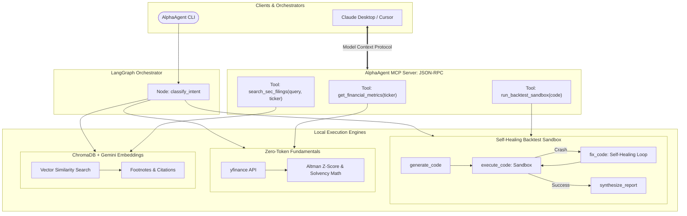

# AlphaAgent 📈🤖

An autonomous, token-efficient financial intelligence platform built on **LangChain**, **LangGraph**, and **Google Gemini** (`gemini-3.6-flash`), with open tool access via **Model Context Protocol (MCP)**.

AlphaAgent bridges the gap between **quantitative market data** and **qualitative regulatory disclosures** through three core agentic workflows:
1. **Quantitative Strategy Backtesting with Autonomous Self-Healing**: Translates plain-English trading ideas into executable Python code, runs backtests over historical market data in an isolated sandbox, and iteratively corrects code bugs in a cyclic feedback loop.
2. **Deterministic Corporate Financial Health & Solvency Audits**: Ingests live financial statements via `yfinance` to compute critical solvency indicators (including the **Altman Z-Score** for bankruptcy prediction, Piotroski scores, and liquidity ratios) with **zero LLM token consumption**.
3. **Qualitative SEC 10-K Filing RAG (Retrieval-Augmented Generation)**: Uses a persistent **ChromaDB** vector store and Google's `gemini-embedding-001` to ingest annual reports, retrieve semantic risk factors and footnotes, and synthesize forensic analyses with **exact source citations**.
4. **Universal Tool Serving via Model Context Protocol (MCP)**: Exposes all financial tools, vector RAG search, and backtest sandbox runners over standard JSON-RPC, enabling external clients (Claude Desktop, Cursor, Antigravity) to consume our engines as a decoupled microservice.

---

## 🏛️ System Architecture

AlphaAgent utilizes a hybrid **"Brain vs. Hands"** architecture. Heavy math, market data extraction, vector similarity scoring, and backtest simulations are executed deterministically on your local CPU for maximum speed and minimal token cost. The LLM is reserved for intent triage, strategy formulation, self-healing bug correction, and executive synthesis.



---

## ✨ Key Features

- **Universal MCP Server (`mcp 2.x`)**: Standalone server exposing quantitative ratios, 10-K RAG, and execution sandboxes over standard `stdio` transport.
- **3-Way Stateful Graph Routing (`LangGraph`)**: Explicit `TypedDict` state schema governing transitions across quantitative backtesting, numerical ratio analysis, and qualitative RAG.
- **Autonomous Self-Healing Reflection Loop**: Catches Python runtime exceptions (`KeyError`, `IndexError`, zero division) in the sandbox and passes the stack trace back to the agent to rewrite and re-run code (up to 3 retries).
- **Agentic RAG Engine with ChromaDB**:
  - Persistent vector store in `data/chroma_db/`.
  - Semantic financial chunking (`chunk_size=900`, `chunk_overlap=150`) to preserve complex financial tables and debt covenants.
  - Strict grounding in official 10-K filings with explicit `[Source: document, Section: ...]` citation tags to eliminate hallucinations.
- **Subprocess Execution Sandbox**: Isolated local execution with timeout protection, stdout/stderr capture, and matplotlib equity curve generation.
- **Ultra-Low Token Economics**: Total run cost is ~1,000–2,000 tokens (< $0.002 per run) on Gemini Flash.

---

## 🔌 Model Context Protocol (MCP) Server

AlphaAgent features a native **Model Context Protocol (MCP)** server built with the official Python `mcp` SDK. This allows any external AI assistant (such as **Claude Desktop**, **Cursor**, or **Antigravity**) to use AlphaAgent's financial intelligence tools directly.

### Registered MCP Tools:
1. `get_financial_metrics(ticker)`: Extracts balance sheet, income statement, margins, and computes the Altman Z-Score.
2. `search_sec_filings(query, ticker)`: Performs semantic vector retrieval across 10-K annual reports in ChromaDB.
3. `run_backtest_sandbox(code)`: Executes a generated trading strategy in a subprocess sandbox and returns performance statistics.

### Run the MCP Server Standalone:
```bash
python src/mcp_server.py
```

### Connect to Claude Desktop (`claude_desktop_config.json`):
```json
{
  "mcpServers": {
    "alpha-agent": {
      "command": "C:/Users/<username>/.../alpha-agent/.venv/Scripts/python.exe",
      "args": ["C:/Users/<username>/.../alpha-agent/src/mcp_server.py"]
    }
  }
}
```

---

## 🚀 Quickstart

### 1. Clone & Setup Virtual Environment

```bash
git clone https://github.com/Satyamk18/quant-langgraph-agent.git
cd quant-langgraph-agent

# Create virtual environment
python -m venv .venv
.\.venv\Scripts\activate  # On Linux/macOS: source .venv/bin/activate

# Install dependencies
pip install -r requirements.txt
```

### 2. Configure Environment Variables

Create your `.env` file based on `.env.example`:
```ini
LLM_PROVIDER=gemini
GEMINI_API_KEY=your_gemini_api_key_here
MODEL_NAME=gemini-3.6-flash
```
*(Get a free Gemini API key from [Google AI Studio](https://aistudio.google.com/app/apikey)).*

### 3. Run the Agent

**Interactive Chat Mode:**
```bash
python main.py
```

**Single Command Queries:**
```bash
# 1. Qualitative SEC 10-K RAG Query
python main.py --query "What specific debt obligations and FAA oversight risks did Boeing disclose in their 10-K filing?"

# 2. Supply Chain & Chip Fabrication RAG Query
python main.py --query "What are Apple's supply chain and TSMC chip manufacturing risks according to their 10-K?"

# 3. Quantitative Strategy Backtest with Charting
python main.py --query "Test a 20 and 50 SMA crossover strategy on NVDA for the last 1 year"

# 4. Deterministic Financial Health & Solvency Audit
python main.py --query "Evaluate the financial health and bankruptcy risk of Boeing (BA)"
```

---

## 🧪 Automated Test Suites

AlphaAgent includes 3 automated test suites covering all layers of the architecture:

### 1. Core Verification Suite (Tools, Sandbox, Self-Healing & Edges)
```bash
python tests/test_agent.py
```

### 2. RAG Verification Suite (ChromaDB Ingestion, Ticker Filtering & Citations)
```bash
python tests/test_rag.py
```

### 3. MCP Protocol Suite (Tool Discovery, JSON-RPC Execution & Payload Validation)
```bash
python tests/test_mcp.py
```

---

## 📁 Project Structure

```
alpha-agent/
├── src/
│   ├── state.py              # LangGraph AgentState TypedDict schema
│   ├── graph.py              # LangGraph StateGraph, 3-way routing & self-healing edges
│   ├── prompts.py            # Prompts for quant coder, debugger, CFA & 10-K analyst
│   ├── llm.py                # LLM factory (Gemini / OpenAI)
│   ├── mcp_server.py         # Standalone Model Context Protocol (MCP) server
│   ├── rag/
│   │   ├── embeddings.py     # Gemini text-embedding-001 factory
│   │   └── vectorstore.py    # ChromaDB persistent store, chunking & retrieval
│   └── tools/
│       ├── executor.py       # Sandboxed local Python execution runner
│       └── financial_data.py # Deterministic yfinance ratio & Altman Z-score calculator
├── data/
│   └── filings/              # Official SEC Form 10-K annual reports (Markdown/Text)
├── outputs/                  # Generated equity curve plots & backtest scripts
├── tests/
│   ├── test_agent.py         # 5-point core verification suite
│   ├── test_rag.py           # 4-point RAG & vectorstore test suite
│   └── test_mcp.py           # 4-point MCP protocol verification suite
├── main.py                   # Rich terminal CLI with citations & scorecard tables
├── requirements.txt          # Production dependencies
└── README.md                 # Project documentation
```

---

## 📄 License
MIT License.
