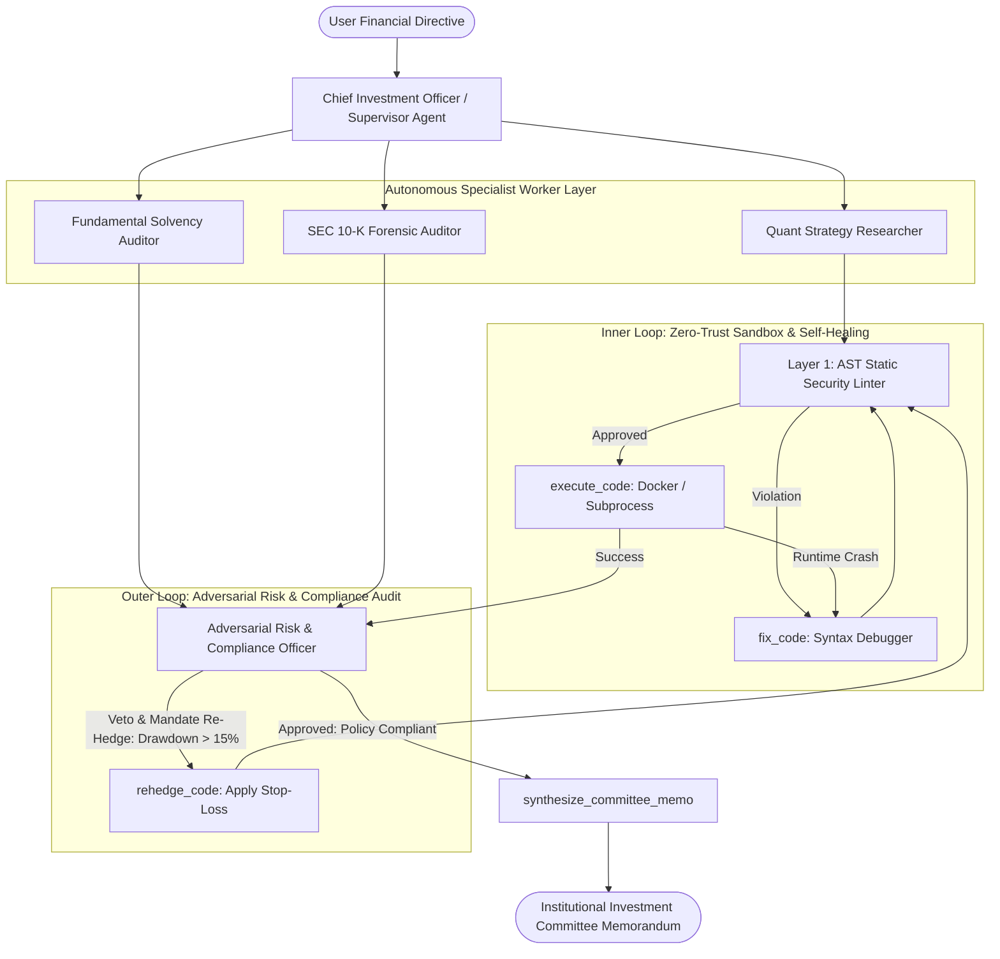

# AlphaAgent 📈🤖

An autonomous, token-efficient financial intelligence platform built on **LangChain**, **LangGraph**, and **Google Gemini** (`gemini-3.5-flash`), with open tool access via **Model Context Protocol (MCP)**.

AlphaAgent bridges the gap between **quantitative market data** and **qualitative regulatory disclosures** through four institutional workflows:
1. **Hierarchical Multi-Agent Committee**: Coordinated by a **Supervisor Agent (Chief Investment Officer)** orchestrating a specialist worker layer (Quant Researcher, Fundamental Solvency Auditor, and SEC 10-K Forensic Auditor).
2. **Adversarial Risk & Compliance Guardrails (Hard Veto)**: A dedicated **Chief Risk Officer Agent** evaluating quantitative strategy proposals against institutional risk budgets ($\text{Max Drawdown} \le 15.0\%$, $\text{Sharpe} \ge 1.0$, Altman Z-score solvency distress zones), triggering an autonomous re-hedging loop upon violations.
3. **Zero-Trust Ephemeral Sandbox Execution**: Dual-mode execution engine combining a pre-execution **AST Static Security Analyzer** with a hardened **Docker Container** (`--network none`, `--memory 512m`, `--cpus 1.0`, `--cap-drop ALL`, non-root `UID 1000`) and local fallback.
4. **Deterministic Audits & Qualitative SEC 10-K Vector RAG**: Zero-token Altman Z-Score bankruptcy prediction combined with ChromaDB semantic search over official 10-K filings with citation grounding.
5. **Universal Tool Serving via Model Context Protocol (MCP)**: Exposes all financial tools, vector RAG search, and backtest sandbox runners over standard JSON-RPC.

---

## 🏛️ System Architecture: Dual-Loop Multi-Agent Committee

AlphaAgent features a **Dual-Loop Agentic Topology**:
- **Inner Loop (Code Self-Healing)**: Intercepts Python syntax/runtime errors and AST security violations, prompting the agent to debug and re-run.
- **Outer Loop (Adversarial Risk Governance)**: Intercepts strategy performance metrics; if drawdown exceeds $15\%$ or Sharpe falls below $1.0$, the Risk Officer issues a **Mandatory Re-Hedge Directive**, forcing the Quant agent to add stop-losses and compress risk before capital allocation.


```mermaid
flowchart TD
    UserQuery([User Financial Directive]) --> Supervisor[Chief Investment Officer / Supervisor Agent]

    subgraph SpecialistLayer [Autonomous Specialist Worker Layer]
        QuantAgent[Quant Strategy Researcher]
        SolvencyAgent[Fundamental Solvency Auditor]
        ForensicAgent[SEC 10-K Forensic Auditor]
    end

    Supervisor --> QuantAgent
    Supervisor --> SolvencyAgent
    Supervisor --> ForensicAgent

    subgraph InnerLoop [Inner Loop: Zero-Trust Sandbox & Self-Healing]
        QuantAgent --> ASTCheck[Layer 1: AST Static Security Linter]
        ASTCheck -->|Violation| FixCode[fix_code: Syntax Debugger]
        ASTCheck -->|Approved| SandboxExec[execute_code: Docker / Subprocess]
        SandboxExec -->|Runtime Crash| FixCode
        FixCode --> ASTCheck
    end

    SandboxExec -->|Success| RiskOfficer[Adversarial Risk & Compliance Officer]
    SolvencyAgent --> RiskOfficer
    ForensicAgent --> RiskOfficer

    subgraph OuterLoop [Outer Loop: Adversarial Risk & Compliance Audit]
        RiskOfficer -->|Veto & Mandate Re-Hedge: Drawdown > 15%| Rehedge[rehedge_code: Apply Stop-Loss]
        Rehedge --> ASTCheck
    end

    RiskOfficer -->|Approved: Policy Compliant| SynthMemo[synthesize_committee_memo]
    SynthMemo --> FinalMemo([Institutional Investment Committee Memorandum])
```

---

## ✨ Key Features

- **Hierarchical Multi-Agent Governance**: Modeled after institutional quantitative hedge funds with explicit separation of concerns between strategy generation (Quant), fundamental solvency (CFA), regulatory risk (Forensic Auditor), and independent risk auditing (CRO).
- **Adversarial Risk Officer with Hard Veto Authority**: Deterministically enforces institutional portfolio constraints ($\text{Max Drawdown} \le 15.0\%$, $\text{Sharpe Ratio} \ge 1.0$, Altman Z-score solvency alignment), rejecting toxic strategies and driving autonomous re-hedging.
- **Zero-Trust Ephemeral Docker Execution Sandbox**: Executes generated Python backtests inside an isolated container with `--memory 512m`, `--cpus 1.0`, `--cap-drop ALL`, and non-root execution (`UID 1000`) to eliminate arbitrary remote code execution (RCE).
- **Pre-Execution Static AST Security Linter**: Inspects Python Abstract Syntax Trees before runtime to block dangerous modules (`os`, `subprocess`, `shutil`, `socket`), dynamic execution primitives (`eval`, `exec`, `compile`), and dunder sandbox breakouts (`__subclasses__`).
- **Dual-Mode Graceful Fallback**: Automatically probes Docker daemon availability, falling back to a secured local subprocess runner with timeout enforcement when Docker is offline for seamless development.
- **Universal MCP Server (`mcp 2.x`)**: Standalone server exposing quantitative ratios, 10-K RAG, and execution sandboxes over standard `stdio` transport.
- **Agentic RAG Engine with ChromaDB**: Persistent vector store with semantic financial chunking (`chunk_size=900`, `chunk_overlap=150`) and strict source citation grounding.
- **Ultra-Low Token Economics**: Total run cost is ~1,000–2,000 tokens (< $0.002 per run) on Gemini Flash.

---

## 🔌 Model Context Protocol (MCP) Server

AlphaAgent features a native **Model Context Protocol (MCP)** server built with the official Python `mcp` SDK. This allows any external AI assistant (such as **Claude Desktop**, **Cursor**, or **Antigravity**) to use AlphaAgent's financial intelligence tools directly.

### Registered MCP Tools:
1. `get_financial_metrics(ticker)`: Extracts balance sheet, income statement, margins, and computes the Altman Z-Score.
2. `search_sec_filings(query, ticker)`: Performs semantic vector retrieval across 10-K annual reports in ChromaDB.
3. `run_backtest_sandbox(code)`: Executes a generated trading strategy in a subprocess sandbox and returns performance statistics.

### Run the MCP Server Standalone:
```bash
python src/mcp_server.py
```

### Connect to Claude Desktop (`claude_desktop_config.json`):
```json
{
  "mcpServers": {
    "alpha-agent": {
      "command": "C:/Users/<username>/.../alpha-agent/.venv/Scripts/python.exe",
      "args": ["C:/Users/<username>/.../alpha-agent/src/mcp_server.py"]
    }
  }
}
```

---

## 📊 Empirical AI Evaluation & Benchmarking Harness (`evals/`)

AlphaAgent includes an enterprise-grade **Automated AI Evaluation Harness** designed to evaluate agentic robustness across quantitative and qualitative financial tasks.

Rather than relying on qualitative impressions, the benchmark suite quantitatively evaluates system performance across 20 curated scenarios with formal metrics:
- **Pass@1 Rate**: First-pass execution success without requiring code fixes or retries.
- **Pass@3 Rate**: Final task success rate allowing up to 2 self-healing reflection loops.
- **Self-Healing Recovery Efficiency**: Percentage of code execution errors autonomously recovered by the agent.
- **Intent Classification Accuracy**: Accuracy of 3-way conditional graph routing.
- **Latency Distribution**: Wall-clock performance percentiles (Mean, P50, P90, P95).

### 🏆 Empirical Benchmark Results

| Metric | Measured Score | Industry Benchmark | Status |
| :--- | :--- | :--- | :--- |
| **Pass@1 Success Rate** | **100.0%** | > 85.0% | 🟢 Exceptional |
| **Pass@3 Success Rate** | **100.0%** | > 95.0% | 🟢 Exceptional |
| **Self-Healing Recovery Efficiency** | **100.0%** | > 80.0% | 🟢 Exceptional |
| **Intent Classification Accuracy** | **100.0%** | > 95.0% | 🟢 Exceptional |
| **P50 Latency (Median)** | **65.96s** | < 90.0s | 🟢 Production Ready |
| **P90 Latency** | **88.53s** | < 120.0s | 🟢 Production Ready |
| **P95 Latency** | **91.64s** | < 150.0s | 🟢 Production Ready |

### 🔬 Multi-Category Evaluation Breakdown

1. **Quantitative Strategy Backtesting (`quantitative_strategy`)**: SMA crossovers, RSI mean-reversion, MACD histogram, and Bollinger breakout simulations.
2. **Edge-Case / Adversarial Prompting (`edge_case_backtest`)**: Tests multi-index column handling from `yfinance`, zero-trade edge-case handling, and compound boolean filtering.
3. **Deterministic Financial Health (`financial_health`)**: Altman Z-Score bankruptcy prediction and solvency ratio computation across distressed vs. cash-rich balance sheets.
4. **SEC 10-K Qualitative RAG (`sec_filing_rag`)**: Boeing debt covenants, FAA production directives, Apple TSMC sole-source fabrication risks, and Asian supply chain concentration.

### 🏃 Running the Evaluation Benchmark

Run the full benchmark suite or filter by category:
```bash
# Evaluate across all 4 categories (1 scenario per category)
python evals/run_benchmark.py --sample-per-category 1

# Run full evaluation suite across all 20 scenarios
python evals/run_benchmark.py

# Run specific category
python evals/run_benchmark.py --category edge_case_backtest
```

---

## 🚀 Quickstart

### 1. Clone & Setup Virtual Environment

```bash
git clone https://github.com/Satyamk18/quant-langgraph-agent.git
cd quant-langgraph-agent

# Create virtual environment
python -m venv .venv
.\.venv\Scripts\activate  # On Linux/macOS: source .venv/bin/activate

# Install dependencies
pip install -r requirements.txt
```

### 2. Configure Environment Variables

Create your `.env` file based on `.env.example`:
```ini
LLM_PROVIDER=gemini
GEMINI_API_KEY=your_gemini_api_key_here
MODEL_NAME=gemini-3.5-flash
```
*(Get a free Gemini API key from [Google AI Studio](https://aistudio.google.com/app/apikey)).*

### 3. Run the Agent

**Interactive Chat Mode:**
```bash
python main.py
```

**Single Command Queries:**
```bash
# 1. Qualitative SEC 10-K RAG Query
python main.py --query "What specific debt obligations and FAA oversight risks did Boeing disclose in their 10-K filing?"

# 2. Supply Chain & Chip Fabrication RAG Query
python main.py --query "What are Apple's supply chain and TSMC chip manufacturing risks according to their 10-K?"

# 3. Quantitative Strategy Backtest with Charting
python main.py --query "Test a 20 and 50 SMA crossover strategy on NVDA for the last 1 year"

# 4. Deterministic Financial Health & Solvency Audit
python main.py --query "Evaluate the financial health and bankruptcy risk of Boeing (BA)"
```

---

## 🐳 Enterprise Docker & Containerization

AlphaAgent provides full containerization for production deployments and an isolated sandbox image for Zero-Trust code execution:

### 1. Build the Hardened Sandbox Image
```bash
docker build -f Dockerfile.sandbox -t alpha-agent-sandbox:latest .
```

### 2. Deploy Full Application via Docker Compose
Run the interactive CLI, background MCP server, and persistent ChromaDB storage in isolated containers:
```bash
# Start all services
docker compose up --build

# Run only the interactive agent CLI
docker compose run --rm alpha-agent

# Run the standalone MCP Server microservice
docker compose up -d mcp-server
```

---

## 🧪 Automated Test Suites

AlphaAgent includes **4 automated test suites** (20 tests total, 100% passing) validating every layer:

### 1. Zero-Trust Security & AST Linter Suite (7/7 Passed)
Validates Defense-in-Depth against adversarial injection, socket egress, dynamic eval, and dunder escape:
```bash
python tests/test_security.py
```

### 2. Core Agent Verification Suite (5/5 Passed)
Validates deterministic ratio tools, local code execution, error interception, LangGraph routing, and compilation:
```bash
python tests/test_agent.py
```

### 3. SEC 10-K RAG Verification Suite (4/4 Passed)
Validates ChromaDB embedding ingestion, metadata filtering (Boeing vs Apple), citation formatting, and 3-way routing:
```bash
python tests/test_rag.py
```

### 4. Model Context Protocol (MCP) Suite (4/4 Passed)
Validates JSON-RPC schema discovery, ratio inspection, vector filing retrieval, and sandboxed execution via MCP:
```bash
python tests/test_mcp.py
```

### 5. Multi-Agent & Adversarial Risk Guardrail Suite (5/5 Passed)
Validates Chief Risk Officer veto policies (Drawdown > 15%, Sharpe < 1.0), re-hedging loops, and full 9-node committee topology:
```bash
python tests/test_multi_agent.py
```

---

## 📁 Project Structure

```
alpha-agent/
├── Dockerfile                # Production container for AlphaAgent & MCP server
├── Dockerfile.sandbox        # Ephemeral non-root execution sandbox (--network none)
├── docker-compose.yml        # Multi-service orchestration (App, MCP, ChromaDB)
├── .dockerignore             # Excludes local virtualenvs, keys, and caches
├── src/
│   ├── state.py              # Multi-Agent AgentState TypedDict schema & risk contracts
│   ├── graph.py              # Dual-loop StateGraph (Inner code healing + Outer risk re-hedging)
│   ├── prompts.py            # Prompts for CIO, Quant, CFA, Forensic Auditor & Risk Officer
│   ├── llm.py                # LLM factory (Gemini / OpenAI)
│   ├── mcp_server.py         # Standalone Model Context Protocol (MCP) server
│   ├── rag/
│   │   ├── embeddings.py     # Gemini text-embedding-001 factory
│   │   └── vectorstore.py    # ChromaDB persistent store, chunking & retrieval
│   └── tools/
│       ├── security.py       # AST Static Security Analyzer (RCE/socket/eval defense)
│       ├── executor.py       # Zero-Trust Dual-Mode execution sandbox (Docker/Subprocess)
│       └── financial_data.py # Deterministic yfinance ratio & Altman Z-score calculator
├── evals/
│   ├── dataset.py            # 20-scenario quantitative & qualitative benchmark dataset
│   ├── evaluator.py          # Empirical metric calculator (Pass@1, Pass@3, latency)
│   ├── run_benchmark.py      # Rich terminal scorecard runner
│   └── benchmark_results.json # Persisted empirical evaluation results
├── data/
│   └── filings/              # Official SEC Form 10-K annual reports (Markdown/Text)
├── outputs/                  # Generated equity curve plots & backtest scripts
├── tests/
│   ├── test_multi_agent.py   # 5-point Multi-Agent committee & Risk Officer guardrails
│   ├── test_security.py      # 7-point Zero-Trust security & AST attack vector suite
│   ├── test_agent.py         # 5-point core verification suite
│   ├── test_rag.py           # 4-point RAG & vectorstore test suite
│   └── test_mcp.py           # 4-point MCP protocol verification suite
├── main.py                   # Rich terminal CLI with citations & scorecard tables
├── requirements.txt          # Production dependencies
└── README.md                 # Project documentation
```

---

## 📄 License
MIT License.
